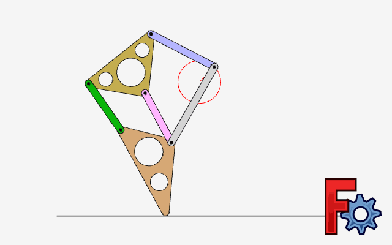
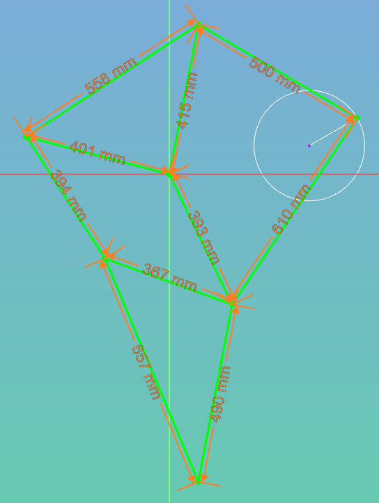

# FreeCAD Assembly 4 example

## Theo Jansen sandwalker

See the video:

https://strandbeest.com/api/uploads/Voorzeil_bewerkt_77dc78a7a4.mp4

https://youtu.be/LewVEF2B_pM

A single leg:

The dimensions:

And here an animation of the movement of all legs:

