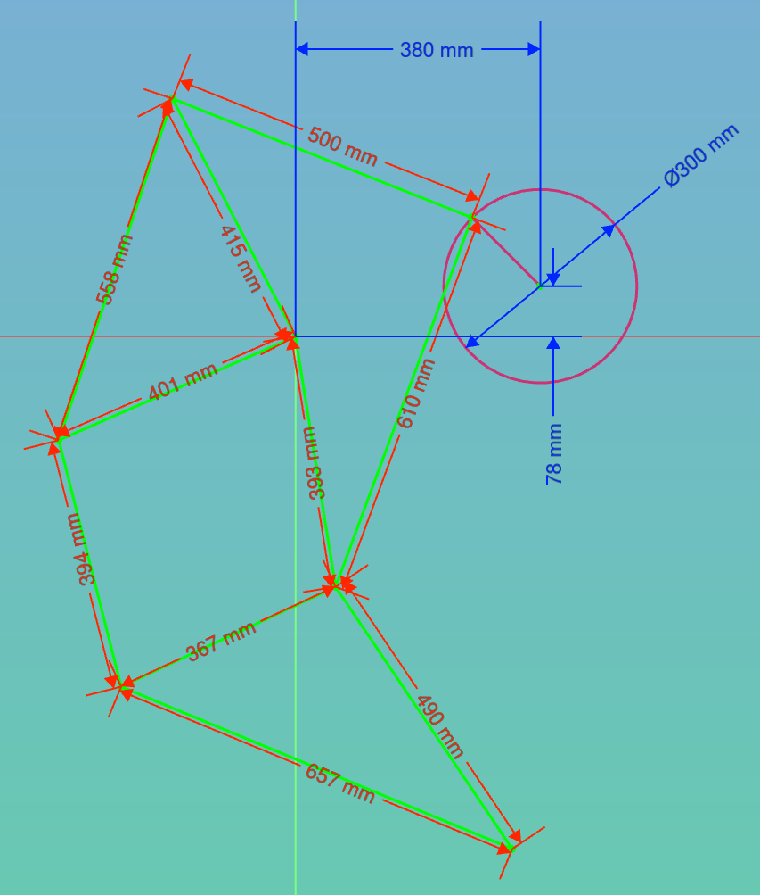

# FreeCAD Assembly 4 example

This tutorial is for advances users, and demonstrates the use of variant links.

## Theo Jansen sandwalker

See the video:

https://strandbeest.com/api/uploads/Voorzeil_bewerkt_77dc78a7a4.mp4

https://youtu.be/LewVEF2B_pM

## Principle

the principle of variant links is to insert into the assembly a link to a part, and setting some variables specific to that link. In other words, it allows to create a generic "part" and insert it multiple times, with each instance having some pre-defined variables set to that instance. 

For example, you can create a generic extruded beam with a default length, and add it several times to an assembly by specifying the length of the beam:

Any variable of the type float in the Variables container can be set for each variant link.

Anothe possibility for variant links is to insert a sub-assembly mutliple times, with each sub-assembly having a specific variable. This is very handy if you want to insert a same sub-assembly many times, where the difference will be in some kinematics of the sub-assembly. This is the example that we will describe here. The same principle can be applied to variant links to parts.

**Important Note:** variant links are more expensive in ressources as regular links, therefore use with caution.

## A single leg:

Crate a single leg for the Theo Janssen sandwalker:

The dimensions:

* create a new document, call it _Walker_Parts_
* create 6 Bodies
* in each body, create a part according to the dimensions
* create a new document, call it _Walker_Leg_
* create an Asm4 _Model_
* in there, create a variable called _Angle_Handle_
* create a Sketch, call it _Sketch_Handle_
* attach it to the LCS origin
* draw a circle and a radius
* set the _AttachmentOffset_ of the sketch to make a rotation of _Angle_Handle_
* create a sketch, call it _Sketch_Leg_
* in there, import as external reference the end-point of the radius
* draw the walker leg as shown above, and attach the rotation handle to the imported point

Now this leg-assembly can be imported several times

## Multiple legs

* create a new document, call it _asm_Walker_8legs_
* create a variable, call it _Assembly_Handle_
* insert a variantLink, choose the _Walker_Leg_

* attach it the LCS origin, offset it length-wise
* set the Variant Variable to _Variables.Assembly_Handle_ + some offset
* do this for each additional leg, adjusting the offset
* now, when you change the variable _Assembly_Handle_, the positions (kinematics) of each leg will be recalculated

## Animate

