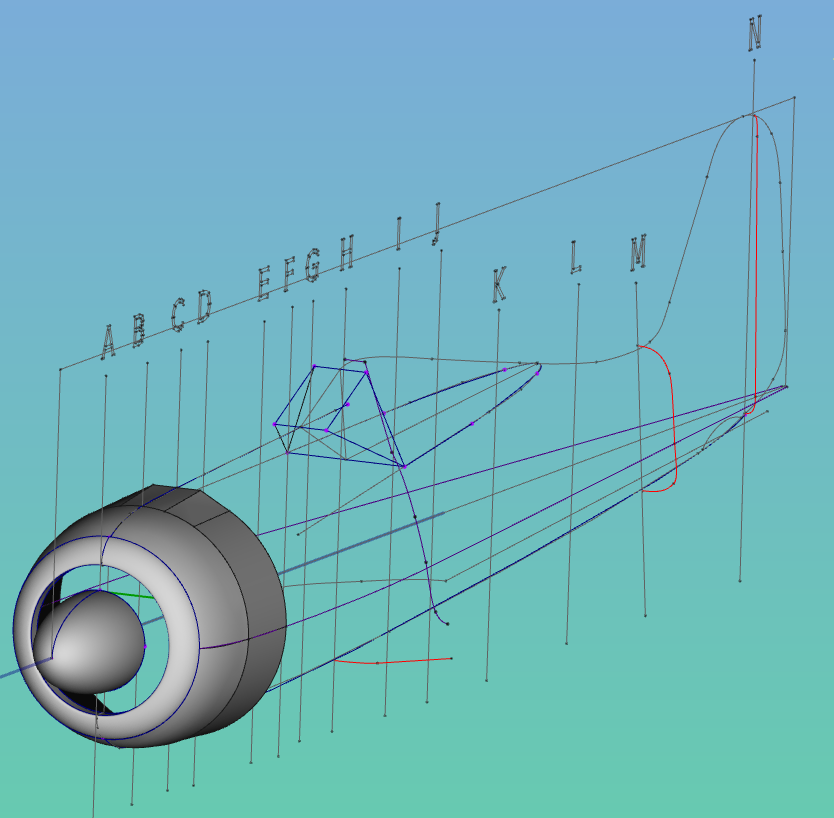
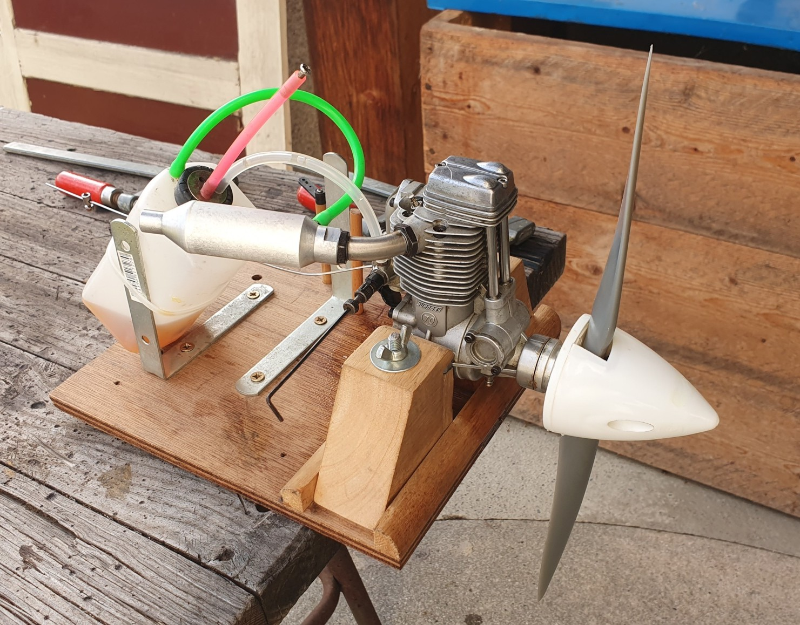

# Tentative Focke-Wulf scale model

This is a directory to model a scaled version of the legendary Focke-Wulf 190

As you can see, there is some work left. Please feel free to improve the model. Objective is either a 1/10th scale model for electric brushless engine or a 1/6 - 1/7 th for on OS-FS70 with a 13x6 propoeller

